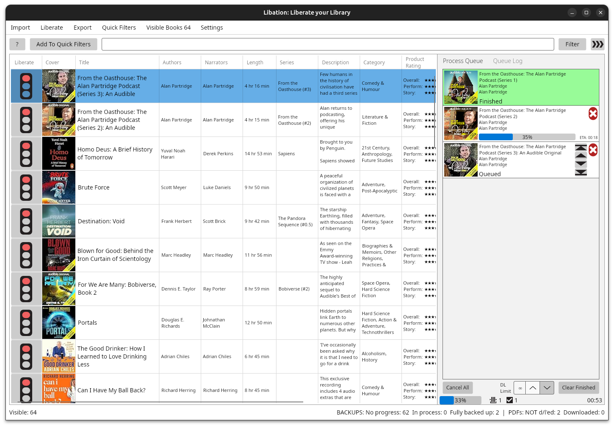

+++
date = '2025-01-10T16:37:43Z'
draft = false
title = 'Libation + Audiobookshelf: A Killer Combination'
cover = 'images/series.jpg'
coverCaption = 'AudioBookShelf'
coverAlt = 'image of AudioBookShelf Web UI'
summary = 'This article explains how to use Libation to download and remove DRM from your Audible library and Audiobookshelf to host it securely on your own server. Together, these tools ensure your audiobooks remain safe and accessible, free from the risks of content rights changes or platform decisions.'
thumbnail = 'images/Thumb.png'
+++


I have over a thousand audiobooks in my Audible library, and lately, I've grown concerned. Rumors have surfaced about Amazon Prime deleting purchased movies due to rights changes or company decisions. This makes me nervous about my Audible books potentially facing the same fate. Given the complex way digital rights management (DRM) works, the idea of losing access to my purchased content is unsettling.

To safeguard my collection, I’ve started downloading and saving my purchased movies (an article about that is coming soon). But more importantly, I’ve found a way to secure my Audible books so they’ll never disappear on me. The solution? **Audiobookshelf** paired with **Libation**.


## What is Audiobookshelf?
Audiobookshelf is a self-hosted application that acts as a personal audiobook server. It can run on cloud servers or home-based setups. In my case, I have a small Intel NUC at home with Docker installed, and I used it to host Audiobookshelf. If you don’t already have Docker, I highly recommend it for running self-hosted applications.

### Installing Audiobookshelf with Docker
Here’s how you can install Audiobookshelf on your server using Docker:

```bash
docker run -d \
  --name=audiobookshelf \
  -e TZ=America/New_York \
  -p 13378:80 \
  -p 13379:443 \
  -v /path/to/config:/config \
  -v /path/to/audiobooks:/audiobooks \
  --restart unless-stopped \
  ghcr.io/advplyr/audiobookshelf
```

Replace `/path/to/config` and `/path/to/audiobooks` with the appropriate directories on your server.

Then to access it, simply go to http://server-ip:13378

It’s a near-perfect drop-in replacement for Audible—except for one thing: you can’t simply upload your Audible library directly to it. This is where **Libation** comes into play.



## What is Libation?
Libation is a powerful tool designed to manage and back up your Audible library. It allows you to download your audiobooks, strip DRM, and store them in formats that can be played on any device. Libation is available for macOS, Linux, and Windows, making it a versatile choice for audiobook enthusiasts.

### Key Features of Libation
- **Library Synchronization**: Connect your Audible account and sync your entire library or selected titles.
- **DRM Removal**: Converts audiobooks to DRM-free formats such as MP3 or M4B.
- **Metadata Management**: Preserves book titles, author information, and chapter details during conversion.
- **Cross-Platform Support**: Available for major operating systems, ensuring accessibility.

### Downloading Audible Books with Libation
1. Download Libation from its [official repository](https://github.com). 
2. Install the software on your system and provide your Audible login credentials.
3. Sync your Audible library. You can either download individual books or the entire library.

Once downloaded, your audiobooks will be DRM-free, meaning you can freely transfer them to Audiobookshelf, just save them in the directory you configured for Audiobookshelf (e.g., `/path/to/audiobooks`).

## Conclusion
With Audiobookshelf and Libation, you can reclaim control over your Audible library and ensure your audiobooks are safe from content rights changes or company missteps. As long as you back up your files, you’ll never lose your collection.

This setup is an excellent way to preserve your investment in digital media. If you’ve been worried about the future of your purchased audiobooks, I highly recommend giving this a try.

