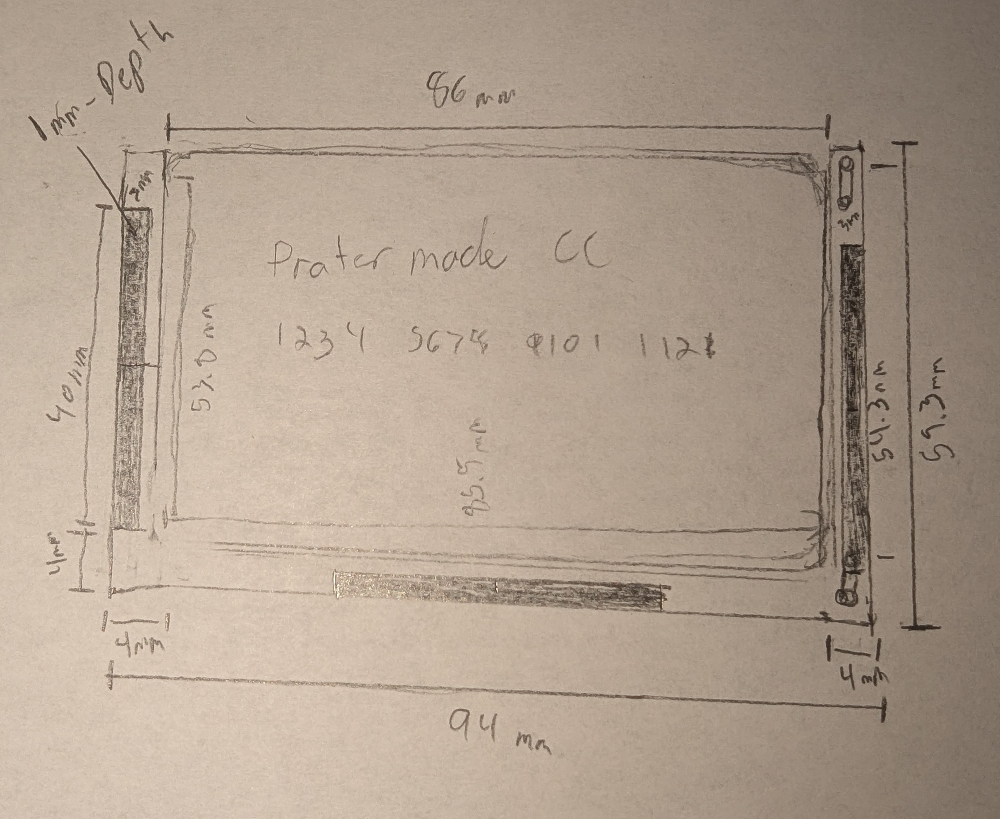

+++
date = '2024-12-21T20:38:43Z'
draft = false
title = 'Cnc Wallet'
+++

## Objective

To Create a wallet design out of wood using my cnc

## Ideas:
 * Sandwich style layout, Top and bottom panels, walnut, middle layer white maple, 
    * will incorporate an elastic band between one layer and the maple layer
    * will machine the maple layer to allow for the attachment (glue) of the elastic strap so that it does not increase the thickness
    * will add a cutout for the elastic strap on one of the panels
    * [possible spring I can use on the inside to hold the cards secure](https://www.mcmaster.com/products/flat-springs/spring-type~disc/corrosion-resistant-curved-disc-springs/)

# Dimensional Information

* CC size: 85.5mm x 53.8mm 
* Elastic Strap 40mm

# Sketches

| Middle Section |
|:----------------:|
||
