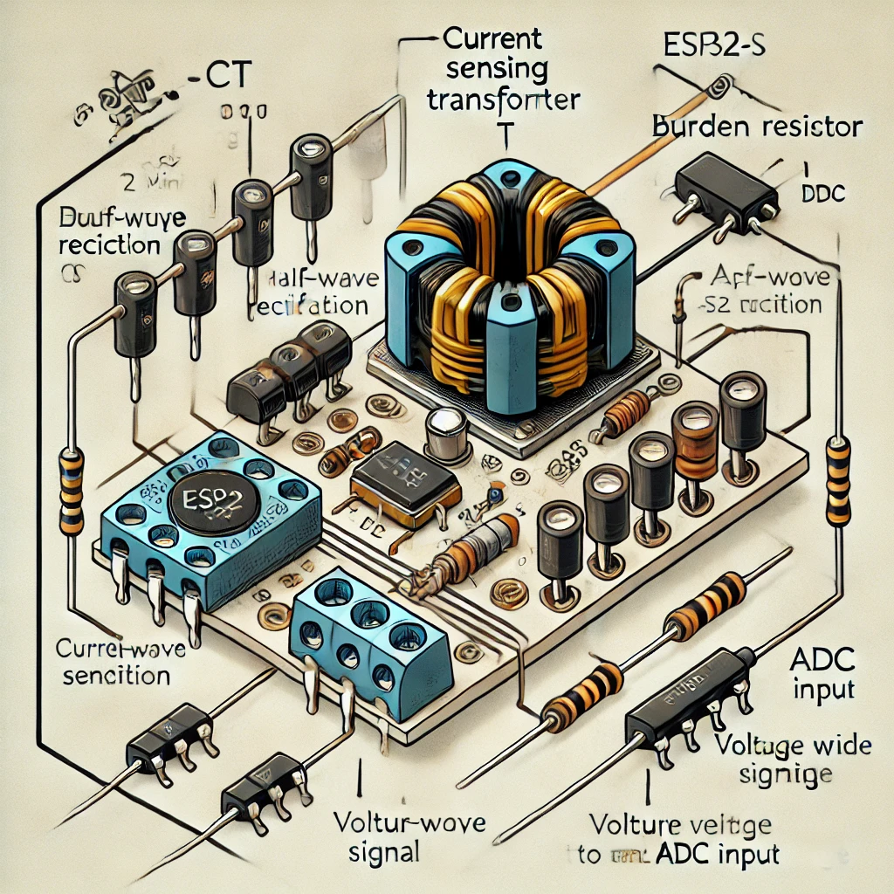
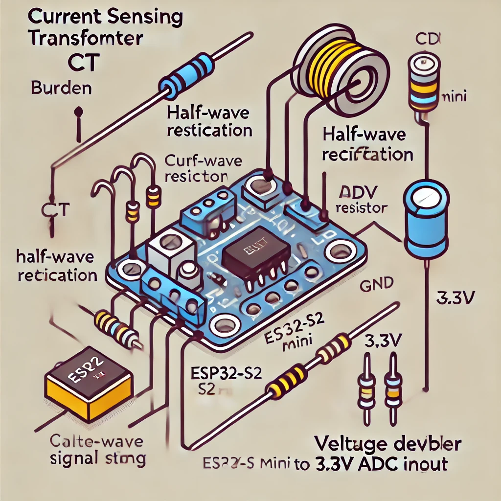

+++
date = '2024-12-08T21:34:15Z'
draft = false
title = "Current Sensing with Esp32"
tags = ["projects"]
showComments = true
+++

## Project description

Attempting to use the esp32 to sense when my table saw is on and using homeassistant to turn on and off my dust collector.

I first attempted to use off the shelf shelly switches, but the current draw was too high. I would burn them out.

## Possible Products

1. [AC Current Sensor Split-Core Clamp Current Transformer](https://www.amazon.com/JANSANE-SCT-013-000-Non-invasive-Split-Core-Transformer/dp/B07D8SXQ13/ref=sr_1_10?dib=eyJ2IjoiMSJ9.Kc9LBM6UN78LWLWTNodECsskNTt9Zhfom0U4aRAAHRkxizdn_OMrpRseDfXB2zG1_wsG5p3WxdMluCLLl5zyE29xdn4DIJHh4H48S7CJpFdF3fVCUt3hrSmIBhd6iF0tu8heWlyM6f5CgqO5TKu8yRtj_N8VkNn0XtoE0pFCcZqW8xAN33v2pMkP3fhFp_2tPrRq9q377wthx2AKyBVJw85HRS-KlRejk-VYqqPZxYk.Gwadtd11E8n6fgzw7ptngJkMKakYdljkoMaXBNIBSdI&dib_tag=se&hvadid=616116262011&hvdev=c&hvlocphy=1026442&hvnetw=g&hvqmt=e&hvrand=11276750169687210548&hvtargid=kwd-763906174482&hydadcr=24357_13533826&keywords=esp32+current+sensor&qid=1734210292&sr=8-10)
2. [HiLetgo 3pcs ZMCT103C 5A AC Current Sensor Current Transformer](https://www.amazon.com/HiLetgo-ZMCT103C-Current-Sensor-Transformer/dp/B0CDWWYLMQ/?_encoding=UTF8&pd_rd_w=B9wF9&content-id=amzn1.sym.255b3518-6e7f-495c-8611-30a58648072e%3Aamzn1.symc.a68f4ca3-28dc-4388-a2cf-24672c480d8f&pf_rd_p=255b3518-6e7f-495c-8611-30a58648072e&pf_rd_r=68NBWAHY9KYVF5ECSDB2&pd_rd_wg=xiacZ&pd_rd_r=82258d8f-1832-4465-995b-318744c310b0&ref_=pd_hp_d_atf_ci_mcx_mr_ca_hp_atf_d)
    * might be able to use this for < 5 amp applications. )
3. [esp32-s2mini](https://www.amazon.com/dp/B0CKLGGNKY?ref=ppx_yo2ov_dt_b_fed_asin_title)
    * [documentation website](https://www.wemos.cc/en/latest/s2/s2_mini.html#documentation)
    * [Datasheet](esp32-s2_datasheet_en.pdf) 


## Wiring
```
                               |------------->3.3
                               R2
                       |---|---|----|
                       |   |   |    |
                    sensor |  Cap1 R1
                       |   |   |    |
                       |---|---|----|--------->GND
                       |
                       |---------------------> ADC0/io1
```
* Cap1 = 10uf
* R1 = 100k (anything 10k-470k)
* R2 = 100k (10k-470k)  

## Possible web references

1. https://simplyexplained.com/blog/Home-Energy-Monitor-ESP32-CT-Sensor-Emonlib/


## Funny Diagrams that Chatgpt offered up:



