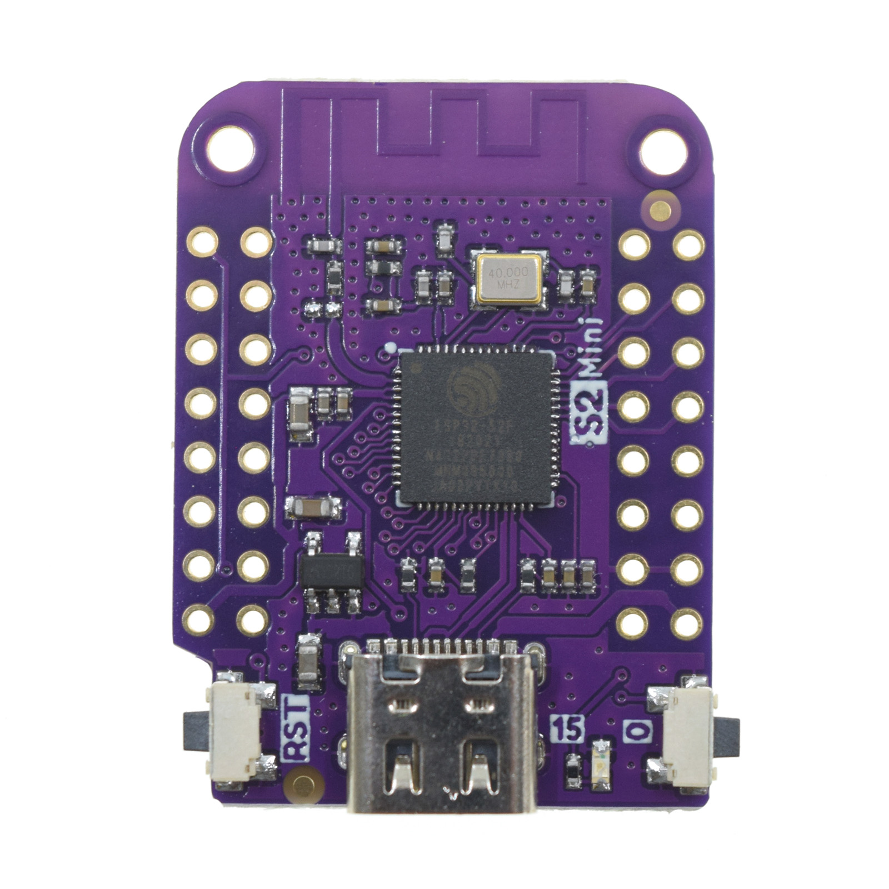

+++
date = '2024-12-08T21:34:15Z'
draft = false
title = "Current Sensing with Esp32"
tags = ["projects"]
showComments = true
+++

## Project description

Attempting to use the esp32 to sense when my table saw is on and using homeassistant to turn on and off my dust collector.

I first attempted to use off the shelf shelly switches, but the current draw was too high. I would burn them out.

## Log

* 12-15-2024
   * Tested circuit - I can see the change of the voltage on the GPIO1 pin, seems to go down when current is applied
   * Looking into MQTT for homassistant integration, see video in web references
   * **Would like to use off-the-shelf tasmoto to simplify setup**
* 12-29-2024
   * Got it working by kind of buteforcing myself around the problem.
    * Set GPIO1 to be ADC input
    * ran command in the tasmodo console: AdcParam `1,0,743,0.121,1.5`
    * got most of the values from [here](https://tasmota.github.io/docs/ADC/) but adjusted the 3rd and 4th and 5th params.
        * Arrived at the  values by adjusting the 4th to work fior 120 volts
        * For the third, I pluggin in an electric kettle and got the real values from an inline power meter like [this](https://www.amazon.com/Electricity-Electrical-Consumption-Backlight-Protection/dp/B09BQNYMMM/ref=sr_1_1?crid=WYA9TS4WIGTO&dib=eyJ2IjoiMSJ9.3nrgb2Y7MwzRLnYaQCD4UWHfQm-VylBR0qpx-1Uk2oyrilimER1tEB8RNgOIgFS3zFmazp1WFrTmSU4n6fVOxIRtiL6F3mAMf9QwMzcdB1HxXOyn7yIVih7qFtxBOuLlSQ_XAYaToIiegU8qSrFK90AfVho_anTW9kHv_T-Uua_XVfW6s763Zvsjum6gb3FDcxGAnR2sfOJ2mbPZTd5-xw.B_8jkrtsDRo3qOg-4DgDJtun8twXbPNPe9JRfOb4iAk&dib_tag=se&keywords=pm01-us&qid=1735507511&sprefix=pm01-us%252Caps%252C131&sr=8-1) Once I had them I adjusted the third param until the numbers on the tasmodo web page were approxmatly the same.
        * Set the last param to where It would read as 0 when the kettle was off, but would still detect when on. Might need adjusted when deployed.

## Possible Products

1. [AC Current Sensor Split-Core Clamp Current Transformer](https://www.amazon.com/JANSANE-SCT-013-000-Non-invasive-Split-Core-Transformer/dp/B07D8SXQ13/ref=sr_1_10?dib=eyJ2IjoiMSJ9.Kc9LBM6UN78LWLWTNodECsskNTt9Zhfom0U4aRAAHRkxizdn_OMrpRseDfXB2zG1_wsG5p3WxdMluCLLl5zyE29xdn4DIJHh4H48S7CJpFdF3fVCUt3hrSmIBhd6iF0tu8heWlyM6f5CgqO5TKu8yRtj_N8VkNn0XtoE0pFCcZqW8xAN33v2pMkP3fhFp_2tPrRq9q377wthx2AKyBVJw85HRS-KlRejk-VYqqPZxYk.Gwadtd11E8n6fgzw7ptngJkMKakYdljkoMaXBNIBSdI&dib_tag=se&hvadid=616116262011&hvdev=c&hvlocphy=1026442&hvnetw=g&hvqmt=e&hvrand=11276750169687210548&hvtargid=kwd-763906174482&hydadcr=24357_13533826&keywords=esp32+current+sensor&qid=1734210292&sr=8-10)
2. [HiLetgo 3pcs ZMCT103C 5A AC Current Sensor Current Transformer](https://www.amazon.com/HiLetgo-ZMCT103C-Current-Sensor-Transformer/dp/B0CDWWYLMQ/?_encoding=UTF8&pd_rd_w=B9wF9&content-id=amzn1.sym.255b3518-6e7f-495c-8611-30a58648072e%3Aamzn1.symc.a68f4ca3-28dc-4388-a2cf-24672c480d8f&pf_rd_p=255b3518-6e7f-495c-8611-30a58648072e&pf_rd_r=68NBWAHY9KYVF5ECSDB2&pd_rd_wg=xiacZ&pd_rd_r=82258d8f-1832-4465-995b-318744c310b0&ref_=pd_hp_d_atf_ci_mcx_mr_ca_hp_atf_d)
    * might be able to use this for < 5 amp applications. )
3. [esp32-s2mini](https://www.amazon.com/dp/B0CKLGGNKY?ref=ppx_yo2ov_dt_b_fed_asin_title)
    * [documentation website](https://www.wemos.cc/en/latest/s2/s2_mini.html#documentation)
    * [Datasheet](esp32-s2_datasheet_en.pdf) 

## Wiring

* Cap1 = 10uf
* R1 = 100k (anything 10k-470k)
* R2 = 100k (10k-470k)  

---

## ChatGPT Circuit Explanation  

### 1. **Current Transformer (CT Sensor: SCT-013-030)**  
- **Function**:  
  The CT sensor measures **AC current** passing through a conductor.  
- **Output**:  
  The SCT-013-030 outputs a small **AC voltage** proportional to the current being measured.  

### 2. **Burden Resistor and Capacitor**  
- The CT sensor requires a **burden resistor** across its output terminals to convert the current signal into a measurable voltage.  
- **Capacitor (10µF)**:  
  - Smooths the AC signal.  
  - Filters out **high-frequency noise** and stabilizes the voltage signal.  

### 3. **Voltage Divider (Resistor 1 and Resistor 2)**  
- The **ESP32 ADC input** cannot accept **negative voltages**.  
- To prevent this, the circuit creates a **voltage bias** at half of the ESP32's supply voltage (1.65V for 3.3V systems).  

#### How It Works:  
- Resistor 1 and Resistor 2 form a **voltage divider** that creates a steady 1.65V reference point.  
- The AC signal from the CT sensor oscillates **above and below** this 1.65V midpoint.  
- This ensures the entire waveform stays within the ESP32’s ADC range (**0V to 3.3V**).  

### 4. **ESP32 Connections**  
| **Pin**                | **Purpose**                              |  
|------------------------|-----------------------------------------|  
| **ESP32 ADC IN (Pin 34)** | Reads the conditioned voltage signal. |  
| **ESP32 GND**          | Common ground for the circuit.          |  
| **ESP32 3.3V**         | Powers the voltage divider (biasing).   |  

### 5. **How the Circuit Works**  

1. **AC Signal Processing**:  
   - The CT sensor outputs an **AC voltage signal** proportional to the measured current.  
   - The burden resistor converts current to voltage.  
   - The capacitor smooths noise.  
   - The voltage divider shifts the signal to center it around **1.65V**.  

2. **ADC Reading**:  
   - The ESP32 reads the **biased AC signal**.  
   - The signal oscillates above and below 1.65V but stays within 0V-3.3V.  

3. **Software Processing**:  
   - Remove the DC bias (1.65V) in software.  
   - Sample the waveform to calculate the **RMS value**.  
   - Use the CT sensor's calibration constant to convert the voltage reading to **current**.  

### 6. **Key Components**  

| **Component**       | **Function**                                      |  
|----------------------|--------------------------------------------------|  
| **CT Sensor**        | Detects current and outputs AC voltage.          |  
| **Burden Resistor**  | Converts current to voltage.                     |  
| **Capacitor (10µF)** | Smooths the signal and reduces high-frequency noise. |  
| **Voltage Divider**  | Creates a 1.65V bias for the AC signal.          |  
| **ESP32 ADC**        | Reads the conditioned voltage signal.            |  

### 7. **Next Steps**  

To process this signal and measure current using the ESP32:  

1. Use the ESP32 ADC to sample the voltage signal.  
2. Subtract the DC bias (1.65V) in software.  
3. Compute the **RMS voltage** of the AC signal.  
4. Use the sensor’s calibration constant to convert voltage to current.  

---

## Web References

1. https://simplyexplained.com/blog/Home-Energy-Monitor-ESP32-CT-Sensor-Emonlib/

[A video about MQTT HomeAssistant Integration](https://youtu.be/tZjW1IHZ3Lc?si=ayxRQA0qnwDzeIZT)


[A video about voltage dividers](https://youtu.be/fmSC0NoaG_I?si=9w7bYceUEaLMtL7A)



## Funny Diagrams that Chatgpt offered up:

